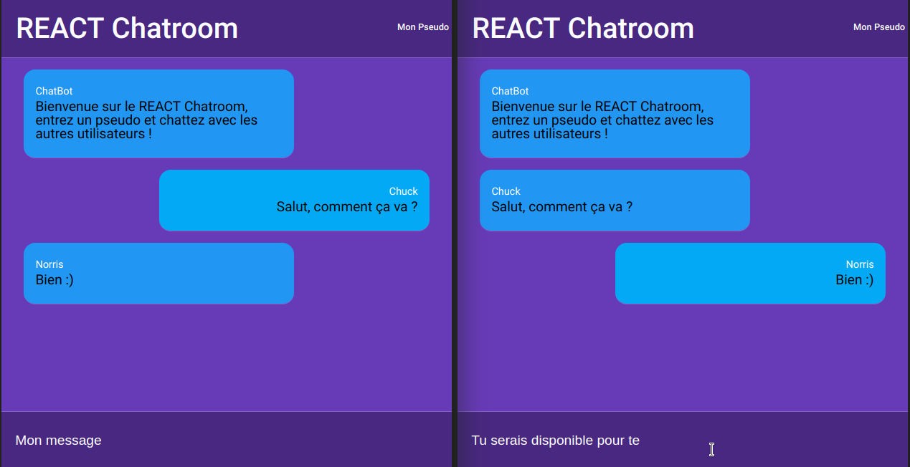

# REACT / NODE Chatroom

 
 
 
 

This is a *chatroom* code in NodeJS + React + Redux.

## How it works

* You can send a message to all connected browsers.

* Tou can change your name.

Here is the application, launched in two different tabs put side by side:

## Server

> **Install depedencies `yarn install`.**

* `yarn start:server` to launch the back server.
* `yarn start` to launch the front server configured with webpack.

Ready to chat?

Enjoy, it's free to use and share :) !

## Author

FabCre

I made this application to practice JavaScript ES6, REACT and NODE.
